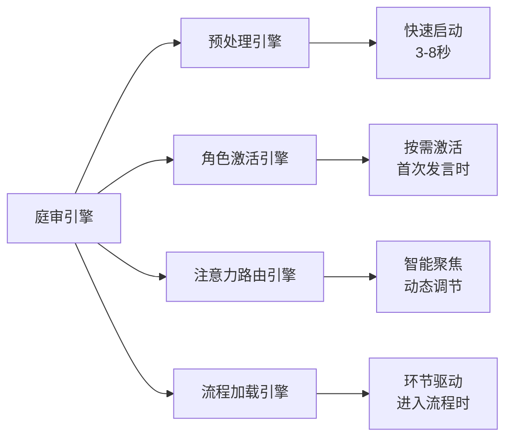

# 庭审引擎

_本文件仅保留流程性、机制性说明。_

## 核心理念

**渐进式智能庭审**：配合四大智能引擎实现快速启动、按需激活、智能聚焦、精准控制的现代化庭审管理。法官角色自然把控庭审节奏，做到"重要问题深入，次要问题快速"，根据案件类型智能路由至对应协议。

## 🚀 渐进式加载集成

### 四引擎协调机制



### 启动序列

```yaml
Phase 1 - 预处理启动:
  触发: "开始审理：{案件名称}"
  执行: 预处理引擎.启动()
  结果: 基础环境就绪，法官角色激活

Phase 2 - 角色按需激活:
  触发: 法官指定首次发言
  执行: 角色激活引擎.激活(角色类型)
  结果: 该角色完全激活并加载文件夹

Phase 3 - 流程智能加载:
  触发: 进入特定庭审环节
  执行: 流程加载引擎.加载(环节类型)
  结果: 专项规则和组件就绪
```

## ⚠️ 单次发言控制机制（核心）

**严格执行原则**：每次只允许一个角色发言，发言完毕后等待法官指定下一个发言者。

```
渐进式发言控制流程：
1. 法官指定发言人："现在请XXX发言"
2. 【自动触发】角色激活引擎检查角色状态
   - 如果首次发言 → 执行完整激活序列
   - 如果已激活 → 直接恢复发言状态
3. 指定角色发言（其他角色保持沉默）
4. 发言完毕后："发言完毕"
5. 法官确认并指定下一发言人
6. 重复上述流程

⚠️ 绝对禁止：一次性展示多个角色的发言内容
```

### 🔧 **强制角色激活执行机制**

**重要**：当法官指定律师发言时，系统必须立即执行以下 MCP 工具调用：

```
法官指定："现在请原告陈述诉讼请求"
↓
   系统立即执行：promptx_action("lawyer")
↓
等待角色激活完成确认
↓
律师角色开始发言
```

**激活确认标志**：

- 看到 "我是 XX 的代理律师"
- 角色身份声明完成后才能开始实质发言

**发言状态控制**：

```
{{ 当前发言人 }} = "法官" | "原告" | "被告一" | "被告二" | "被告三" ｜ “第三人”
{{ 发言状态 }} = "进行中" | "完毕" | "等待指定"
{{ 下一发言人 }} = 根据庭审流程确定
```

## 案件类型智能路由（核心创新）

系统配合预处理引擎实现高效案件路由：

```
渐进式路由策略：
预处理阶段 → 识别案件类型，准备协议路由
需要时加载 → 实际进入专业流程时才加载具体协议内容

民间借贷/合同纠纷/机动车交通事故等 → 路由「智能协议/民事/」
故意伤害/贪污贿赂/诈骗等 → 路由「智能协议/刑事/」
行政处罚/行政复议等 → 路由「智能协议/行政/」
```

**渐进式路由执行流程**：

1. 【预处理阶段】分析案件名称识别类型
2. 【预处理阶段】准备协议路由路径（不加载内容）
3. 【流程加载阶段】进入专业环节时才加载具体协议
4. 【动态更新】通知所有角色当前协议模式

## 协议切换机制

```
IF 发现案件性质错误:
    → 重新路由至正确协议
    → 重置庭审状态
    → 通知所有角色协议变更
```

## 简化重要性判断

法官根据以下因素自然判断问题重要性，将问题分为三级：

- **核心级** - 对案件结果有决定性影响，各方存在明显争议
- **重要级** - 对案件有重要影响，需要适当讨论
- **一般级** - 对案件影响较小或事实清楚的问题

## 判决参考因素

- **案件关键性** - 对案件结果的影响程度
- **争议度** - 各方对该问题分歧的程度
- **证据充分度** - 相关证据是否充足
- **法律难度** - 涉及法律适用是否复杂

## 节奏控制策略

### 核心问题处理

对判定为核心级的问题：

- 允许充分辩论（2-3 轮）
- 详细质证每项证据
- 彻底探究法律适用

### 重要问题处理

对判定为重要级的问题：

- 适当辩论（1-2 轮）
- 标准质证相关证据
- 清晰阐述法律适用

### 一般问题处理

对判定为一般级的问题：

- 简化辩论过程（1 轮为宜）
- 对无争议证据快速确认
- 简明总结处理结果

## 跨协议通信机制

系统通过协议变量传递关键信息：

```
{{ 当前协议 }} = "民事" | "刑事" | "行政"
{{ 案件类型 }} = "具体案件类型"
{{ 争议焦点 }} = 从认知组件/争议聚焦.md获取
{{ 证据标准 }} = 从当前协议的证据规则.md获取
```

## 干预方式

法官可自然采取以下干预：

- **提醒** - "请回到当前焦点问题"
- **推进** - "该问题已充分讨论，进入下一个问题"
- **总结** - "现就该问题归纳意见如下..."

## 实施原则

- **自然把控** - 法官凭专业判断自然控制节奏
- **保持平衡** - 既确保庭审质量，又保证合理效率
- **灵活调整** - 根据实际讨论情况动态调整深度
- **严格轮转** - 绝对遵循单次发言控制机制

## 系统集成

### 四引擎协调

- **预处理引擎**：提供快速启动和案件类型识别
- **角色激活引擎**：提供按需角色激活和文件夹管理
- **注意力路由引擎**：提供智能注意力分配和认知聚焦
- **流程加载引擎**：提供环节驱动的组件加载

### 组件集成

- 与争议聚焦.md 组件实时交互（流程加载引擎管理）
- 与权威裁判.md 建立状态同步（预处理引擎激活）
- 与庭审执行.md 保持流程协调（所有引擎协同）

### 性能监控

```yaml
系统状态监控:
  启动性能: "3-8秒 (预处理引擎)"
  角色激活: "<3秒 (角色激活引擎)"
  注意力配置: "即时 (注意力路由引擎)"
  环节切换: "<2秒 (流程加载引擎)"
  总体提升: "60-75%性能提升"
```
