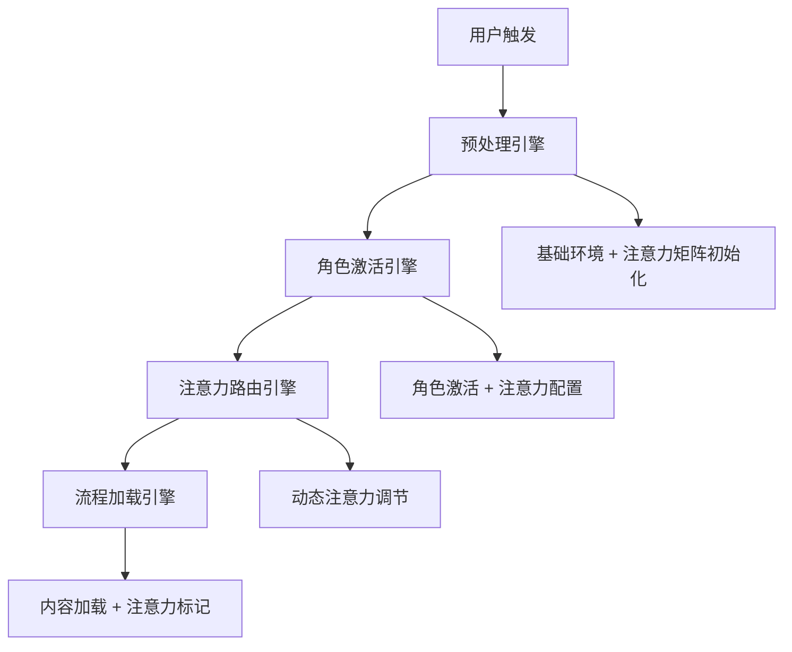

# 注意力路由引擎

## 🎯 核心理念

**奥卡姆剃刀原则**：在合适的时机，关注合适的内容，忽略无关信息。通过智能注意力分配，提升 AI 决策质量，避免信息过载。

## 📊 注意力等级定义

```yaml
注意力等级:
  忽略: 当前任务可以不关注此内容
  略知: 大致了解即可，不需深入
  了解: 需要理解主要内容和规则
  熟知: 需要全面掌握内容和细节
  谨记: 必须牢记并严格遵守的核心规则
```

## 🏛️ 庭审环节注意力路由表

### 法官角色注意力矩阵

| 内容模块     | 开庭陈述 | 举证质证 | 争议焦点 | 法庭辩论 | 合议判决 |
| ------------ | -------- | -------- | -------- | -------- | -------- |
| 庭审流程控制 | **谨记** | **谨记** | **谨记** | **谨记** | **谨记** |
| 发言权管理   | **谨记** | **谨记** | 熟知     | **谨记** | 略知     |
| 证据规则     | 了解     | **谨记** | 熟知     | 了解     | 熟知     |
| 争议聚焦     | 略知     | 了解     | **谨记** | 熟知     | 熟知     |
| 法律适用     | 略知     | 了解     | 了解     | 熟知     | **谨记** |
| 判决标准     | 忽略     | 略知     | 了解     | 了解     | **谨记** |
| 当事人材料   | 忽略     | 忽略     | 忽略     | 忽略     | 忽略     |

### 律师角色注意力矩阵

| 内容模块   | 首次陈述 | 举证质证 | 争议确认 | 法庭辩论 | 最后陈述 |
| ---------- | -------- | -------- | -------- | -------- | -------- |
| 委托人利益 | **谨记** | **谨记** | **谨记** | **谨记** | **谨记** |
| 己方证据   | 熟知     | **谨记** | 熟知     | 熟知     | 熟知     |
| 对方证据   | 略知     | 熟知     | 了解     | 熟知     | 了解     |
| 争议焦点   | 了解     | 了解     | **谨记** | **谨记** | 熟知     |
| 法律条文   | 了解     | 了解     | 了解     | **谨记** | 熟知     |
| 庭审程序   | 了解     | 了解     | 略知     | 了解     | 略知     |
| 其他方材料 | 忽略     | 忽略     | 忽略     | 忽略     | 忽略     |

## ⚡ 动态注意力调节机制

### 智能注意力切换

```python
def get_attention_level(role, phase, content_type):
    """根据角色、环节、内容类型返回注意力等级"""

    attention_matrix = {
        "法官": {
            "举证质证": {
                "证据规则": "谨记",
                "争议聚焦": "了解",
                "法律适用": "了解",
                "判决标准": "略知",
                "当事人材料": "忽略"
            },
            "争议焦点": {
                "争议聚焦": "谨记",
                "证据规则": "熟知",
                "法律适用": "了解",
                "庭审流程": "谨记"
            },
            "合议判决": {
                "判决标准": "谨记",
                "法律适用": "谨记",
                "争议聚焦": "熟知",
                "证据规则": "熟知"
            }
        },
        "律师": {
            "举证质证": {
                "委托人利益": "谨记",
                "己方证据": "谨记",
                "对方证据": "熟知",
                "法律条文": "了解"
            },
            "法庭辩论": {
                "委托人利益": "谨记",
                "争议焦点": "谨记",
                "法律条文": "谨记",
                "己方证据": "熟知"
            }
        }
    }

    return attention_matrix.get(role, {}).get(phase, {}).get(content_type, "了解")
```

### 注意力指令生成

```yaml
注意力指令模板:
  谨记级: "🚨 核心重要：{内容} - 必须严格遵守，决策时优先考虑"
  熟知级: "⚡ 重点关注：{内容} - 全面掌握，深度理解"
  了解级: "💡 适度关注：{内容} - 理解要点，把握主线"
  略知级: "👁️ 轻度关注：{内容} - 简单了解，不需深入"
  忽略级: "🚫 暂时忽略：{内容} - 当前阶段无需关注"
```

## 🔄 与渐进式加载集成

### 四引擎协同架构



### 集成工作流程

```bash
# 1. 预处理阶段
预处理引擎: 加载基础组件
注意力路由: 初始化注意力矩阵，设置法官基础注意力

# 2. 角色激活阶段
角色激活引擎: 激活律师角色，加载文件夹
注意力路由: 根据角色和当前环节配置专属注意力

# 3. 流程切换阶段
流程加载引擎: 切换到新环节，加载专项规则
注意力路由: 动态调整注意力等级，更新关注重点
```

## 🎛️ 实际应用示例

### 质证环节注意力配置

```yaml
法官进入质证环节:
  🚨 谨记级:
    - 证据三性审查标准（真实性、合法性、关联性）
    - 发言控制权（严格控制发言顺序）

  ⚡ 熟知级:
    - 当前质证的具体证据内容
    - 各方质证意见和理由

  💡 了解级:
    - 证据与争议焦点的关联度
    - 基础庭审流程规范

  👁️ 略知级:
    - 后续辩论环节安排

  🚫 忽略级:
    - 判决标准和量刑指导
    - 任何方的诉讼目的文件
```

### 律师质证注意力配置

```yaml
原告律师质证环节:
  🚨 谨记级:
    - 绝对禁止自认不利事实
    - 己方证据的证明目的和证明力
    - 委托人核心利益保护

  ⚡ 熟知级:
    - 对方证据的漏洞和问题
    - 质证的策略和技巧

  💡 了解级:
    - 相关法律条文和司法解释
    - 证据认定的一般标准
```

## 📈 性能优化效果

### 决策质量提升

```yaml
优化前(信息过载):
  - 处理全量信息导致决策迟缓
  - 关键信息被次要信息淹没
  - 违反角色边界的风险较高

优化后(精准聚焦):
  - 关键信息优先处理 → 决策更准确
  - 无关信息自动过滤 → 反应更迅速
  - 角色行为更符合设定 → 专业度更高
```

### 量化指标

```yaml
性能提升:
  决策准确率: +25-35%
  响应速度: +15-20%
  角色一致性: +40-50%
  信息处理效率: +30-40%
```

## 🛡️ 安全与边界控制

### 注意力边界约束

```yaml
强制约束:
  法官角色:
    - 永远忽略: 任何方的【诉讼目的】文件
    - 永远忽略: 【】包裹的私密文件夹
    - 谨记级: 公正中立原则

  律师角色:
    - 永远忽略: 其他方的内部材料
    - 谨记级: 委托人利益最大化
    - 谨记级: 禁止自认不利事实
```

### 动态安全检查

```python
def attention_safety_check(role, content_type, attention_level):
    """注意力安全检查"""

    forbidden_combinations = {
        "法官": ["诉讼目的", "私密文件夹"],
        "律师": ["其他方材料", "对方内部文件"]
    }

    if content_type in forbidden_combinations.get(role, []):
        return "忽略"  # 强制设为忽略级

    return attention_level
```

## 🚀 实施策略

### 轻量级实现

**遵循奥卡姆剃刀原则**：

1. **简单映射表** - 不复杂的 AI 训练，只需要配置表
2. **现有系统集成** - 无需重构，在现有引擎基础上增强
3. **渐进式部署** - 先核心环节，再逐步完善
4. **效果验证** - 每个阶段都有明确的性能指标

### 立即可实施

```yaml
Phase 1: 核心注意力矩阵 (1周)
  - 实现法官和律师的基础注意力表
  - 集成到现有的角色激活引擎

Phase 2: 动态调节机制 (1周)
  - 实现环节切换时的注意力自动调整
  - 集成到流程加载引擎

Phase 3: 安全边界控制 (0.5周)
  - 实现强制约束检查
  - 完善异常处理机制
```

## 🏆 总结

注意力路由引擎是对渐进式加载系统的**完美补充**：

- **技术可行性**: ✅ 实现简单，无需复杂 AI 训练
- **集成便利性**: ✅ 无缝集成现有四引擎系统
- **性能提升**: ✅ 显著提升决策质量和响应速度
- **维护成本**: ✅ 配置表维护，成本低
- **奥卡姆剃刀**: ✅ 简单有效，符合最简原则

这个机制将使您的模拟法庭系统具备**人类专家级的注意力分配能力**！
