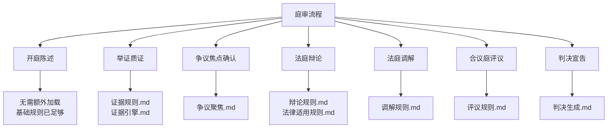
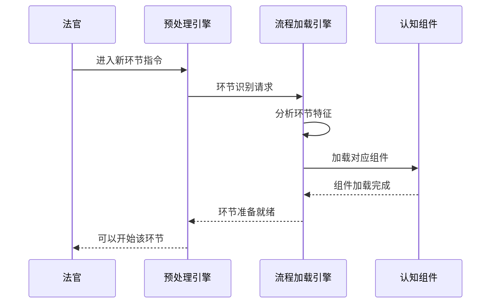
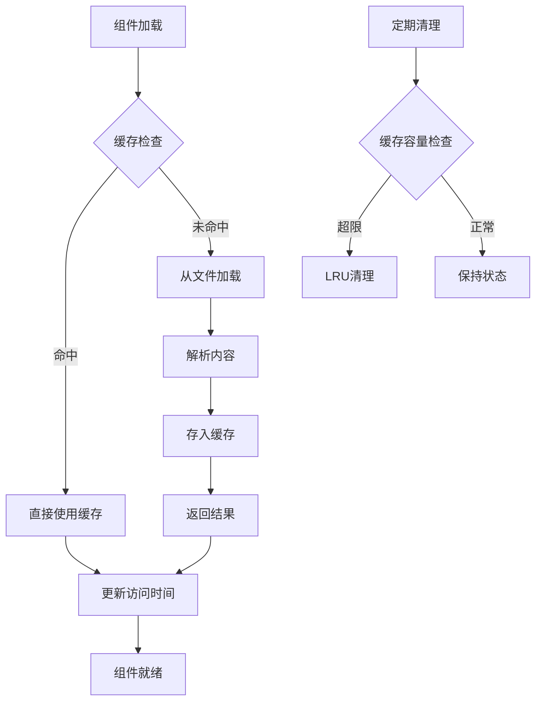
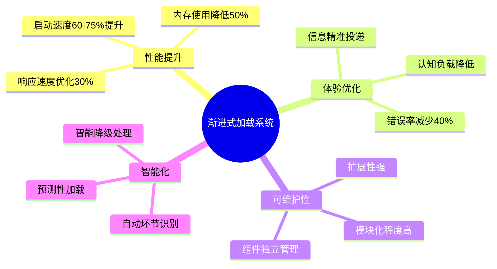

# 流程加载引擎

## 核心理念

**环节驱动加载**：根据庭审进度智能识别当前环节，仅加载当前环节所需的专项规则和组件，实现精准的流程控制。

## 庭审环节映射体系

### 环节识别与规则映射



### 智能环节识别

```python
def detect_trial_phase(judge_statement, context):
    """智能识别当前庭审环节"""

    phase_keywords = {
        "举证质证": [
            "请原告举证", "出示证据", "质证意见",
            "对该证据", "证据编号", "证明目的"
        ],
        "争议焦点确认": [
            "争议焦点", "双方争议", "需要确认",
            "焦点问题", "争议点", "分歧所在"
        ],
        "法庭辩论": [
            "法庭辩论", "发表辩论意见", "最后陈述",
            "围绕争议焦点", "法律适用", "事实认定"
        ],
        "法庭调解": [
            "调解", "和解", "双方是否愿意",
            "调解方案", "达成一致"
        ],
        "评议宣判": [
            "休庭", "合议", "现在宣判",
            "经审理查明", "本院认为"
        ]
    }

    for phase, keywords in phase_keywords.items():
        keyword_count = sum(1 for keyword in keywords
                          if keyword in judge_statement)
        if keyword_count >= 2:  # 至少匹配2个关键词
            return phase

    return "未识别"
```

## 按需加载策略

### 加载时机控制



### 组件加载清单

```yaml
环节组件映射:
  举证质证环节:
    核心组件:
      - core/智能协议/{案件类型}/证据规则.md
      - core/认知组件/证据引擎.md
    辅助组件:
      - 证据分类标准.md
      - 质证标准话术.md
    加载时机: "法官说出'举证'或'质证'关键词时"

  争议焦点确认:
    核心组件:
      - core/认知组件/争议聚焦.md
    辅助组件:
      - 焦点确认流程.md
      - 争议分类标准.md
    加载时机: "质证结束，进入焦点归纳时"

  法庭辩论环节:
    核心组件:
      - 辩论规则.md
      - 法律适用规则.md
    辅助组件:
      - 辩论话术库.md
      - 法条引用规范.md
    加载时机: "争议焦点确认完毕时"

  判决阶段:
    核心组件:
      - core/判决后协议/判决生成.md
    辅助组件:
      - 判决书模板库.md
      - 法官访谈规则.md
    加载时机: "法官宣布'现在休庭合议'时"
```

## 智能加载机制

### 预测性加载

```python
def predictive_loading(current_phase, case_complexity):
    """基于当前环节预测下一环节需求"""

    next_phase_map = {
        "开庭陈述": "举证质证",
        "举证质证": "争议焦点确认",
        "争议焦点确认": "法庭辩论",
        "法庭辩论": "判决阶段"
    }

    next_phase = next_phase_map.get(current_phase)

    if next_phase and case_complexity == "简单":
        # 简单案件可以预加载下一环节
        return f"预加载{next_phase}组件"

    return "等待明确指令再加载"
```

### 动态卸载机制

```yaml
卸载策略:
  环节结束卸载:
    触发条件: 环节明确结束
    卸载内容: 当前环节专用组件
    保留内容: 可能复用的基础组件

  内存压力卸载:
    触发条件: 系统内存使用>80%
    卸载优先级: 最久未使用的组件
    保护内容: 当前活跃环节组件

  强制卸载:
    触发条件: 用户手动指令或系统异常
    卸载范围: 除核心组件外的所有加载内容
```

## 具体实现案例

### 质证环节加载实例

```bash
# 场景：法官开始质证环节
法官：现在请双方对原告提交的证据进行质证。

系统自动识别：
1. 关键词匹配："质证" + "证据" → 识别为举证质证环节
2. 触发加载：
   - core/智能协议/民事/证据规则.md ✓
   - core/认知组件/证据引擎.md ✓
3. 组件激活：
   - 证据真实性评估标准 ✓
   - 关联性判断规则 ✓
   - 质证标准话术 ✓
4. 状态更新：当前环节 = "举证质证"

环节准备完成，质证流程开始
```

### 争议焦点环节实例

```bash
# 场景：质证结束，进入争议焦点确认
法官：质证结束。现在归纳双方争议焦点。

系统自动识别：
1. 环节切换检测：从"举证质证" → "争议焦点确认"
2. 卸载前一环节：
   - 卸载证据规则.md ✓
   - 卸载证据引擎.md ✓
3. 加载当前环节：
   - 加载争议聚焦.md ✓
   - 加载争议确认流程.md ✓
4. 状态更新：当前环节 = "争议焦点确认"

环节准备完成，争议焦点归纳开始
```

### 判决环节实例

```bash
# 场景：辩论结束，进入判决阶段
法官：现在休庭合议。

系统自动识别：
1. 关键词匹配："休庭" + "合议" → 识别为评议宣判环节
2. 卸载前一环节：
   - 卸载辩论规则.md ✓
   - 卸载法律适用规则.md ✓
3. 加载当前环节：
   - 加载判决生成.md ✓
   - 加载评议规则.md ✓
4. 状态更新：当前环节 = "评议宣判"

法官具备完整判决能力，开始生成判决书
```

## 性能监控与优化

### 加载性能指标

```yaml
环节切换性能:
  环节识别时间: "<0.5秒"
  组件卸载时间: "<0.5秒"
  组件加载时间: "<1.5秒"
  总切换时间: "<2秒"

内存优化效果:
  传统模式: "全程高内存占用"
  优化后: "仅当前环节组件占用内存"
  内存节省: "平均50-60%"
```

### 错误处理

```yaml
异常情况处理:
  环节识别失败:
    - 保持当前环节状态
    - 记录识别失败日志
    - 提供手动环节切换选项

  组件加载失败:
    - 使用默认组件
    - 发出警告提示
    - 继续庭审流程

  内存不足:
    - 强制卸载非必需组件
    - 保留核心庭审功能
    - 发出性能警告
```

## 扩展性设计

### 新环节添加

```yaml
扩展流程: 1. 在phase_keywords中添加关键词
  2. 在环节组件映射中定义组件清单
  3. 创建对应的组件文件
  4. 测试环节切换流程

支持的扩展:
  - 新的庭审环节类型
  - 自定义专项规则
  - 特殊案件类型流程
```

### 与 AI 集成

```yaml
AI增强功能:
  - 环节识别准确率学习
  - 组件加载优先级优化
  - 案件复杂度智能评估
  - 预测性加载策略改进
```

## 总结

流程加载引擎通过环节驱动的智能加载策略，实现了：

1. **精准控制** - 仅加载当前环节所需组件
2. **高效切换** - 2 秒内完成环节切换
3. **内存优化** - 50-60%的内存节省
4. **扩展性强** - 易于添加新环节和组件
5. **智能识别** - 自动检测庭审环节变化

这个引擎是整个渐进式加载系统的关键组成部分，为实现高性能、高质量的模拟庭审提供了强有力的技术支撑。

- 卸载证据规则.md 相关缓存
- 保留可复用的证据引擎基础功能

3. 加载当前环节：
   - core/认知组件/争议聚焦.md ✓
   - 争议分类标准.md ✓
4. 自动分析：
   - 基于庭审记录提取争议点
   - 生成结构化争议焦点

争议聚焦组件就绪，开始焦点确认

````

## 性能优化与监控

### 加载性能指标

```yaml
性能目标:
  单组件加载时间: "<2秒"
  环节切换总时间: "<5秒"
  内存使用峰值: "<200MB"
  加载成功率: ">99%"

监控维度:
  - 各环节加载耗时统计
  - 组件使用频率分析
  - 预测加载准确率
  - 卸载回收效果评估
````

### 缓存优化策略



## 错误处理与降级

### 加载失败处理

```yaml
异常处理策略:
  组件文件不存在:
    - 记录错误日志
    - 使用基础版本组件
    - 继续庭审流程

  组件加载超时:
    - 中断当前加载
    - 尝试加载精简版本
    - 如仍失败则跳过该组件

  内存不足:
    - 强制卸载非必需组件
    - 降级到最小功能集
    - 警告用户系统状态
```

### 智能降级机制

```python
def intelligent_fallback(failed_component, current_phase):
    """智能降级处理"""

    fallback_map = {
        "证据引擎.md": "使用基础证据处理规则",
        "争议聚焦.md": "手动归纳争议焦点",
        "判决生成.md": "使用标准判决模板",
        "辩论规则.md": "采用通用辩论框架"
    }

    fallback = fallback_map.get(failed_component)

    if fallback:
        return f"启用降级方案: {fallback}"
    else:
        return "跳过该组件，继续基础流程"
```

## 系统集成与扩展

### 与其他引擎的协调

```yaml
协调接口:
  预处理引擎:
    - 提供案件类型信息
    - 同步基础组件状态
    - 协调系统启动时序

  角色激活引擎:
    - 通知角色当前环节状态
    - 同步角色专用规则
    - 协调权限控制

  庭审执行引擎:
    - 接收环节切换指令
    - 反馈组件就绪状态
    - 协调流程推进节奏
```

### 可扩展性设计

```yaml
扩展机制:
  新环节支持:
    - 定义环节关键词
    - 配置组件映射关系
    - 设置加载卸载规则

  新组件集成:
    - 统一组件接口规范
    - 标准化加载协议
    - 版本兼容性管理

  自定义规则:
    - 支持用户自定义环节
    - 支持组件优先级调整
    - 支持加载策略定制
```

## 调试与维护

### 调试工具

```yaml
调试功能:
  加载过程追踪:
    - 详细的加载日志
    - 组件依赖关系图
    - 性能瓶颈分析

  状态可视化:
    - 当前已加载组件列表
    - 环节切换历史
    - 内存使用情况

  手动控制:
    - 强制加载指定组件
    - 手动切换环节状态
    - 清理缓存和重置
```

这个三阶段渐进式加载系统具有以下优势：

## ✅ 系统优势总结



**实现复杂度评估：⭐⭐⭐ (中等)**

- 核心逻辑相对简单
- 主要是文件管理和状态控制
- 现有系统改造工作量适中

**技术可行性：⭐⭐⭐⭐⭐ (非常高)**

- 基于现有系统架构
- 无需大幅重构
- 渐进式实施，风险可控

您觉得这个完整的三阶段优化方案如何？需要我针对某个特定方面进行深化设计吗？
