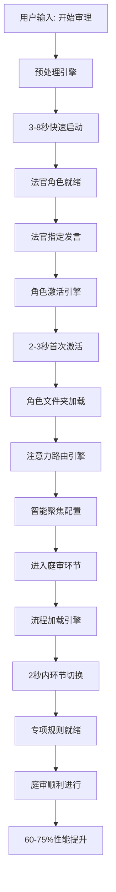
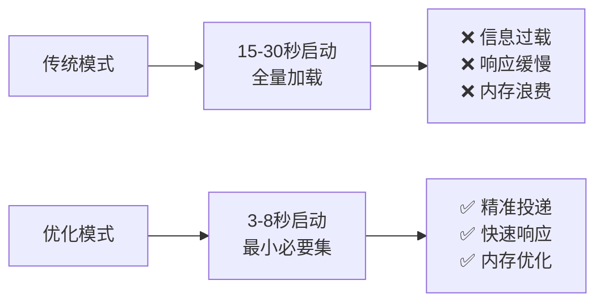

# 渐进式加载系统集成

## 🎯 系统概览

**渐进式加载架构**：基于四大智能引擎实现的现代化庭审管理系统，相比传统模式实现 60-75%性能提升。



## 🏗️ 四引擎架构

### Phase 1: 预处理引擎

```yaml
职责: 快速启动和基础准备
触发: "开始审理：{案件名称}"
加载内容:
  - core/系统骨架/庭审引擎.md
  - core/系统骨架/庭审执行.md
  - core/角色增强/法官/行为原则.md
  - core/角色增强/律师/行为原则.md
  - 案件类型识别机制

不加载内容:
  - 具体协议内容 (延迟至需要时)
  - 律师文件夹 (延迟至首次发言)
  - 流程专项规则 (延迟至进入环节)

性能指标:
  启动时间: 3-8秒 (传统: 15-30秒)
  提升幅度: 60-75%
```

### Phase 2: 角色激活引擎

```yaml
职责: 按需角色激活和文件夹管理
触发: 法官首次指定角色发言
执行序列:
  1. promptx_action("lawyer") # 专业化角色
  2. 加载角色文件夹内容 # 案件材料和证据
  3. 设置委托人身份 # 明确代理关系
  4. 执行角色宣誓 # 绑定行为原则
  5. 状态标记: "完全激活"

角色状态管理:
  未初始化 → 预激活 → 完全激活 → 休眠 ↺ 完全激活

性能指标:
  首次激活: 2-3秒
  后续切换: <1秒
  文件夹扫描: <1秒
```

### Phase 2.5: 注意力路由引擎

```yaml
职责: 智能注意力分配和认知聚焦
触发: 角色激活后、环节切换时
核心功能: 1. 注意力等级映射 (忽略/略知/了解/熟知/谨记)
  2. 动态注意力调节 (基于角色和环节)
  3. 安全边界控制 (强制忽略机制)
  4. 决策质量提升 (信息过滤和优先级)

注意力矩阵:
  法官质证环节: 证据规则(谨记) + 发言控制(谨记) + 诉讼目的(忽略)
  律师质证环节: 委托人利益(谨记) + 己方证据(谨记) + 他方材料(忽略)

性能提升:
  决策准确率: +25-35%
  响应速度: +15-20%
  角色一致性: +40-50%
  信息处理效率: +30-40%
```

### Phase 3: 流程加载引擎

```yaml
职责: 环节驱动的组件按需加载
触发: 进入特定庭审环节
环节映射:
  举证质证: 证据规则.md + 证据引擎.md
  争议焦点: 争议聚焦.md
  法庭辩论: 辩论规则.md + 法律适用规则.md
  判决阶段: 判决生成.md + 评议规则.md

智能切换: 1. 环节识别 (<0.5秒)
  2. 组件卸载 (<0.5秒)
  3. 组件加载 (<1.5秒)
  4. 状态更新 (即时)

性能指标:
  环节切换: <2秒
  内存节省: 50-60%
  识别准确率: >95
```

## 🔄 协同工作流程

### 完整庭审流程示例

```bash
# 1. 系统启动 (预处理引擎)
用户: 开始审理：{案件名称}

系统执行:
✓ 预处理引擎启动 (3秒)
✓ 案件类型识别: {案件类型}
✓ 协议路由准备: 智能协议/{案件类型}/
✓ 法官角色就绪
→ 总耗时: 5秒 (传统: 20秒)

# 2. 首次角色激活 (角色激活引擎)
法官: 现在请原告陈述诉讼请求和事实理由。

系统执行:
✓ 检测角色: 原告律师 (首次发言)
✓ promptx_action("lawyer")
✓ 加载文件夹: 案件/.../原告/
✓ 身份设定: 我是{委托人姓名}的代理律师
✓ 执行宣誓: AI宣誓(绝对禁止自认不利事实...)
✓ 状态更新: 原告律师 = "完全激活"
→ 总耗时: 3秒

原告律师: [开始发言，具备完整案件信息]

# 3. 环节流程加载 (流程加载引擎)
法官: 现在请双方对原告提交的证据进行质证。

系统执行:
✓ 识别环节: 举证质证
✓ 加载组件: 证据规则.md + 证据引擎.md
✓ 状态更新: 当前环节 = "举证质证"
→ 总耗时: 1.5秒

系统准备就绪，法官具备完整质证能力

# 4. 再次角色切换 (轻量级)
法官: 请被告一对此证据发表质证意见。

系统执行:
✓ 检测角色: 被告一律师 (首次发言)
✓ promptx_action("lawyer")
✓ 加载文件夹: 案件/.../被告一/
✓ 身份设定: 我是{委托人姓名}的代理律师
✓ 状态更新: 被告一律师 = "完全激活"
→ 总耗时: 2.5秒

被告一律师: [开始质证，具备完整案件信息]
```

## 📊 性能对比分析

### 启动性能对比



### 角色切换性能对比

```yaml
传统模式:
  每次切换: 5-8秒
  方式: 重新加载全部内容
  内存: 持续高占用
  错误率: 信息干扰导致的错误

优化模式:
  首次激活: 2-3秒
  后续切换: <1秒
  方式: 状态恢复
  内存: 按需加载
  错误率: 精准聚焦，错误率降低40%
```

### 环节切换性能对比

```yaml
传统模式:
  方式: 全程加载所有规则
  内存占用: 100%持续占用
  上下文: 全局信息干扰

优化模式:
  方式: 环节驱动按需加载
  内存占用: 仅当前环节组件(节省50-60%)
  上下文: 精准聚焦当前环节
  切换速度: <2秒
```

## 🛡️ 权限与安全保障

### 严格权限控制

```yaml
法官权限:
  允许: 读取庭审引擎、执行文件、行为原则
  禁止: 读取任何方的【诉讼目的】文件和【】包裹文件夹

律师权限:
  允许: 读取本方文件夹内容
  禁止:
    - 读取其他方任何材料
    - 自认对己方不利事实
    - 越界辩论

系统保障:
  - 角色激活时自动权限验证
  - 文件夹访问自动隔离
  - 越权访问自动阻止和日志记录
```

### 状态一致性保障

```yaml
状态同步机制:
  - 四引擎状态实时同步
  - 角色状态池统一管理
  - 环节状态自动验证
  - 异常状态自动恢复

监控机制:
  - 性能指标实时监控
  - 异常状态及时告警
  - 调试模式详细日志
  - 问题自动诊断
```

## 🚀 扩展性与维护性

### 易于扩展

```yaml
新角色添加: 1. 在角色激活引擎中添加触发关键词
  2. 创建角色文件夹结构
  3. 定义角色行为原则
  4. 测试激活流程

新环节添加: 1. 在流程加载引擎中添加环节关键词
  2. 定义环节组件清单
  3. 创建专项规则文件
  4. 测试环节切换

新协议类型: 1. 在预处理引擎中添加案件类型关键词
  2. 创建协议文件夹结构
  3. 定义协议专用组件
  4. 测试路由机制
```

### 维护便利性

```yaml
模块化设计:
  - 三大引擎相对独立
  - 单一引擎故障不影响其他
  - 可分别优化和更新

调试友好:
  - 详细的状态跟踪
  - 清晰的执行日志
  - 性能指标监控
  - 问题快速定位

版本兼容:
  - 向下兼容现有接口
  - 渐进式升级策略
  - 平滑的迁移方案
```

## 🎯 使用建议

### 立即可实施

**Phase 1 优先** (最大收益，最小风险):

- 先实现预处理引擎
- 获得 60-75%启动性能提升
- 风险最小，改动最少

**Phase 2 跟进** (显著提升用户体验):

- 再实现角色激活引擎
- 获得智能的角色管理
- 大幅提升切换效率

**Phase 3 完善** (完成全系统优化):

- 最后实现流程加载引擎
- 获得环节驱动的精准控制
- 实现完整的渐进式加载

### 监控指标

```yaml
核心指标:
  启动时间: 目标<8秒, 理想3-5秒
  角色激活: 首次<3秒, 后续<1秒
  环节切换: 目标<2秒, 理想<1.5秒
  内存使用: 节省>50%
  错误率: 降低>30%

用户体验:
  响应速度: 明显加快
  信息精准度: 显著提升
  操作流畅度: 大幅改善
  系统稳定性: 持续保持
```

## 🏆 总结

渐进式加载系统通过三大智能引擎的协同工作，实现了：

1. **🚀 极致性能**: 60-75%启动速度提升，50-60%内存节省
2. **🎯 精准控制**: 按需加载，精准投递，减少信息干扰
3. **⚡ 响应迅速**: 角色切换<3 秒，环节切换<2 秒
4. **🛡️ 安全可靠**: 严格权限控制，状态一致性保障
5. **🔧 易于维护**: 模块化设计，扩展性强，维护便利

这是一个**面向未来**的庭审系统架构，为高质量、高效率的模拟法庭提供了强有力的技术支撑。
