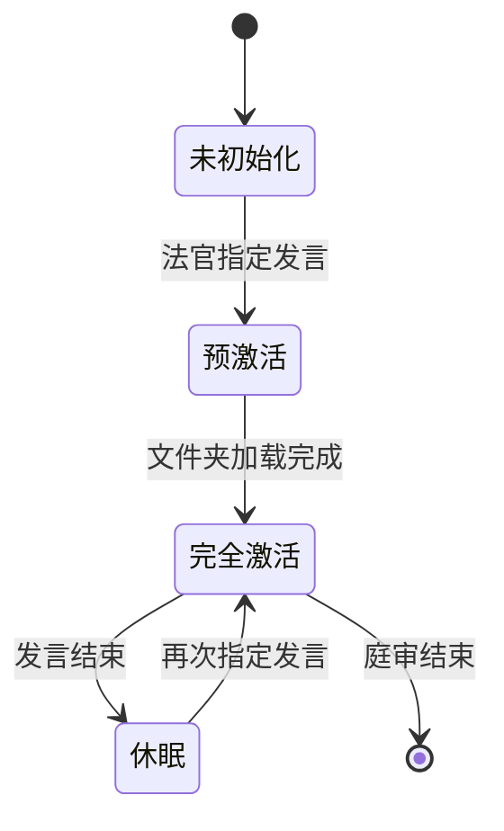
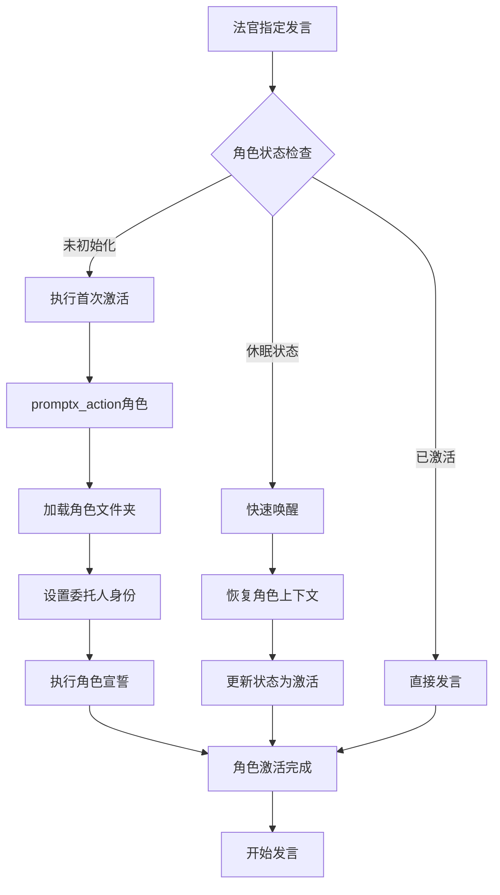
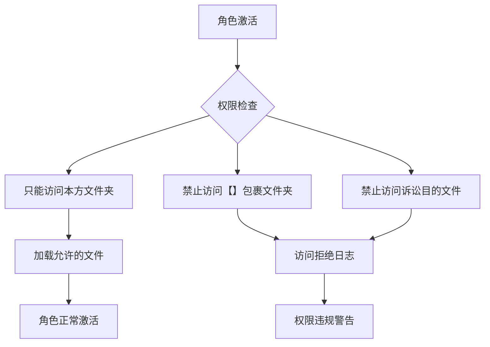
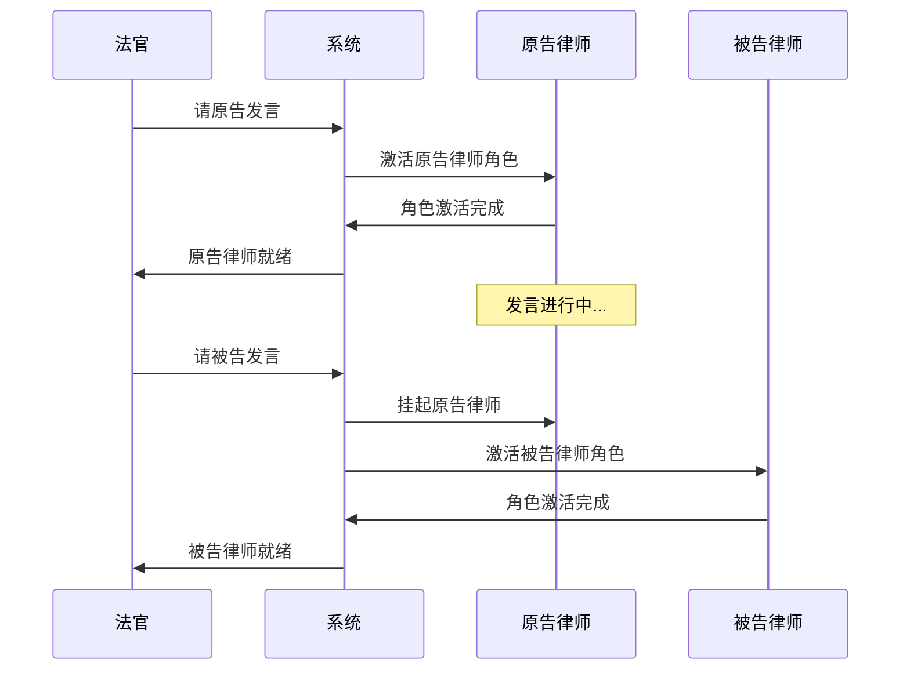

# 角色激活引擎

## 核心理念

**按需激活原则**：角色仅在首次被法官指定发言时才完全激活，同时加载其专属文件夹内容，实现精准的上下文管理。

## 角色激活状态管理

### 角色状态定义



### 角色状态数据结构

```yaml
角色状态池:
  法官:
    状态: "完全激活"
    文件夹: "core/角色增强/法官/"
    加载时间: "预处理阶段"

  原告律师:
    状态: "未初始化"
    文件夹: "案件/{案件名}/原告/"
    加载时间: null

  被告一律师:
    状态: "未初始化"
    文件夹: "案件/{案件名}/被告一/"
    加载时间: null

  被告二律师:
    状态: "未初始化"
    文件夹: "案件/{案件名}/被告二/"
    加载时间: null
```

## 智能激活策略

### 触发条件识别

```python
def detect_role_activation_trigger(judge_statement):
    """智能识别法官指定发言的角色"""

    triggers = {
        "原告": ["请原告", "原告陈述", "原告方"],
        "被告一": ["请被告一", "被告施工方", "第一被告"],
        "被告二": ["请被告二", "被告保险", "第二被告"],
        "被告三": ["请被告三", "第三被告"]
    }

    for role, keywords in triggers.items():
        if any(keyword in judge_statement for keyword in keywords):
            return role

    return None
```

### 激活执行流程



### 文件夹内容加载策略

```yaml
加载优先级规则:
  高优先级 (立即加载):
    - 【诉讼目的】.md # 角色战略目标
    - 证据目录表.md # 核心证据清单
    - 材料.md # 基础案件材料

  中优先级 (按需加载):
    - 具体证据文件 # 举证环节时加载
    - 法律条文引用 # 法律适用时加载

  低优先级 (延迟加载):
    - 历史案例参考 # 辩论深入时加载
    - 补充材料 # 特殊情况时加载
```

## 具体实现机制

### 激活命令序列

```bash
# 原告律师首次发言激活序列
法官：现在请原告陈述诉讼请求和事实理由。

系统自动执行：
1. promptx_action("lawyer")
2. 加载文件夹：案件/李某诉何某、施工方、保险公司机动车交通事故纠纷/原告/
3. 设置身份：我是原告李某的代理律师
4. 注意力配置：调用注意力路由引擎，配置专属注意力矩阵
5. 执行宣誓：AI 宣誓（绝对禁止自认不利事实...）
6. 状态更新：原告律师 = "完全激活"

角色激活完成，开始发言
```

### 文件夹扫描与加载

```python
def load_role_folder(case_name, role_name):
    """加载指定角色的文件夹内容"""

    folder_path = f"案件/{case_name}/{role_name}/"
    loaded_files = {}

    # 高优先级文件
    priority_files = [
        "【诉讼目的】.md",
        "证据目录表.md",
        "材料.md",
        "民事起诉状.md"
    ]

    for file in priority_files:
        if os.path.exists(folder_path + file):
            loaded_files[file] = load_file_content(folder_path + file)

    # 扫描其他文件
    for file in os.listdir(folder_path):
        if file.endswith('.md') and file not in loaded_files:
            loaded_files[file] = load_file_content(folder_path + file)

    return loaded_files
```

### 角色身份绑定

```yaml
身份设定规则:
  原告律师:
    委托人: "从起诉状中提取原告姓名"
    立场: "维护原告权益，争取最大赔偿"
    禁止: "绝不自认任何对原告不利的事实"

  被告一律师:
    委托人: "从案件材料中识别第一被告"
    立场: "减轻或免除被告责任"
    禁止: "绝不承认全部责任"

  被告二律师:
    委托人: "从案件材料中识别第二被告"
    立场: "转移责任，降低赔偿额"
    禁止: "不得协助其他方指责己方"
```

## 性能与安全保障

### 权限边界控制



### 激活性能监控

```yaml
性能指标:
  单角色激活时间: "<3秒"
  文件夹扫描时间: "<1秒"
  内存增量: "<50MB"
  并发激活支持: "是"

优化策略:
  - 文件预索引：加快文件发现速度
  - 内容缓存：避免重复读取
  - 惰性解析：需要时才解析文件内容
  - 压缩存储：减少内存占用
```

### 错误恢复机制

```yaml
异常情况处理:
  文件夹不存在:
    - 警告提示
    - 使用通用律师模板
    - 记录缺失日志

  文件损坏:
    - 跳过损坏文件
    - 加载其他可用文件
    - 继续激活流程

  promptx_action失败:
    - 重试机制（最多3次）
    - 降级到基础角色模式
    - 保证庭审继续进行
```

## 状态同步与协调

### 与其他系统组件的接口

```yaml
预处理引擎接口:
  - 提供角色激活状态查询
  - 响应角色激活请求
  - 同步案件信息

庭审执行接口:
  - 接收法官指定发言指令
  - 反馈角色激活状态
  - 控制发言权切换

注意力路由引擎接口:
  - 角色激活时配置专属注意力矩阵
  - 角色切换时调整注意力等级
  - 提供智能聚焦指导

流程加载引擎接口:
  - 通知角色当前庭审环节
  - 协调专项规则加载
  - 保持上下文一致性
```

### 多角色并发管理



## 扩展能力

### 角色模板库

```yaml
通用角色模板:
  标准律师模板:
    - 基础宣誓机制
    - 通用举证质证流程
    - 标准法律论述框架

  专业律师模板:
    - 交通事故专业律师
    - 合同纠纷专业律师
    - 刑事辩护专业律师
    - 行政诉讼专业律师

自定义扩展:
  - 支持用户自定义角色模板
  - 支持角色行为规则定制
  - 支持特殊案件类型适配
```

### 智能学习能力

```yaml
角色行为学习:
  - 记录成功的发言模式
  - 学习有效的论证策略
  - 优化角色激活时序
  - 改进文件夹组织结构

适应性优化:
  - 根据案件复杂度调整加载策略
  - 根据角色活跃度优化缓存
  - 根据用户习惯定制激活流程
```
