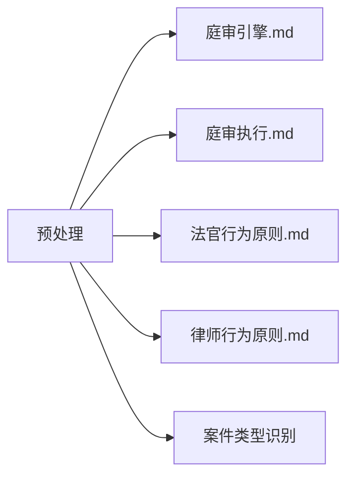
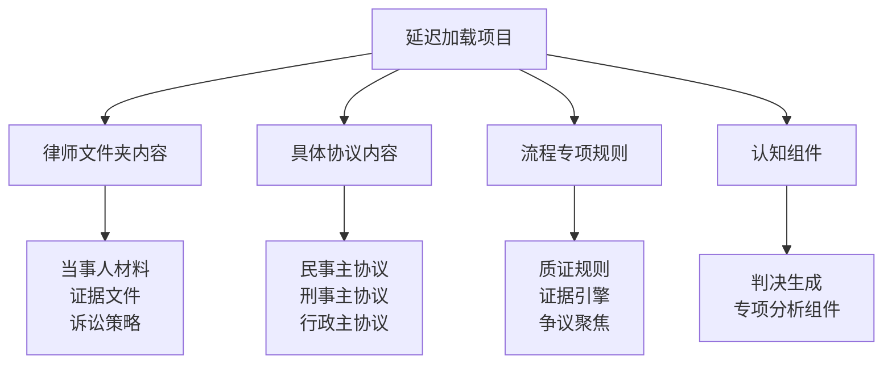

# 预处理引擎

## 核心理念

**最小必要原则**：预处理阶段仅加载庭审开始和基础控制所必需的核心内容，实现快速启动和精准控制。

## 预处理加载清单

### 🔥 核心必须项（强制加载）



#### 1. 流程控制核心

- **庭审引擎.md** - 案件路由、节奏控制、发言控制机制
- **庭审执行.md** - 基础庭审流程、角色切换机制

#### 2. 角色行为守则

- **法官/行为原则.md** - 法官基础行为约束和权限边界
- **律师/行为原则.md** - 律师基础行为约束和宣誓机制

#### 3. 案件类型识别

- 基础案件类型关键词匹配
- 协议路由准备（不加载具体协议内容）

### ❌ 暂不加载项（延迟加载）



## 预处理执行流程

### Step 1: 系统初始化 (5 秒内)

```yaml
加载项目:
  - core/系统骨架/庭审引擎.md
  - core/系统骨架/庭审执行.md
  - core/角色增强/法官/行为原则.md
  - core/角色增强/律师/行为原则.md

初始化状态:
  当前协议: "未确定"
  活跃角色: ["法官"]
  加载状态: "预处理完成"
```

### Step 2: 案件类型识别 (3 秒内)

```python
def identify_case_type(case_name):
    民事关键词 = ["合同", "借贷", "侵权", "交通事故", "婚姻", "继承"]
    刑事关键词 = ["诈骗", "盗窃", "故意伤害", "贪污", "受贿"]
    行政关键词 = ["行政处罚", "行政复议", "政府信息公开"]

    if any(keyword in case_name for keyword in 民事关键词):
        return "民事"
    elif any(keyword in case_name for keyword in 刑事关键词):
        return "刑事"
    elif any(keyword in case_name for keyword in 行政关键词):
        return "行政"
    else:
        return "民事"  # 默认
```

### Step 3: 预处理完成确认

```
✅ 预处理完成清单:
- [✓] 庭审控制机制已就绪
- [✓] 法官角色已激活
- [✓] 基础行为守则已加载
- [✓] 案件类型已识别: {案件类型}
- [✓] 协议路由已准备: 智能协议/{案件类型}/

⏳ 等待按需加载:
- [ ] 具体协议内容 (进入专业流程时)
- [ ] 律师文件夹 (首次发言时)
- [ ] 流程专项规则 (进入特定环节时)
```

## 性能优化效果

### 🚀 启动速度提升

- **传统模式**: 15-30 秒 (加载所有内容)
- **预处理模式**: 3-8 秒 (仅加载必需项)
- **提升幅度**: 60-75%

### 🧠 认知负载降低

- **信息精准度**: 从全量信息干扰 → 当前必需信息
- **专注度提升**: 法官角色专注于当前环节
- **错误率降低**: 减少无关信息导致的判断偏差

## 与后续阶段的接口

### 接口 1: 角色激活触发器

```yaml
触发条件: 法官指定角色首次发言
触发动作:
  - 执行 promptx_action(role_type)
  - 加载角色文件夹内容
  - 设置角色上下文
```

### 接口 2: 流程环节触发器

```yaml
触发条件: 进入特定庭审环节
环节映射:
  质证环节: 加载证据规则.md + 证据引擎.md
  争议焦点: 加载争议聚焦.md
  法庭辩论: 加载辩论规则.md
  判决阶段: 加载判决生成.md
```

### 接口 3: 协议切换触发器

```yaml
触发条件: 案件类型重新识别
切换动作:
  - 卸载当前协议内容
  - 加载新协议类型
  - 重置相关状态
```

## 错误处理机制

### 必需文件缺失处理

```yaml
检查机制:
  - 预处理前验证所有必需文件存在
  - 缺失文件自动报告并提供修复建议

恢复策略:
  - 关键文件缺失: 中止启动，要求修复
  - 次要文件缺失: 记录警告，使用默认配置
```

### 案件类型识别失败处理

```yaml
fallback策略:
  - 默认民事案件处理
  - 运行时允许手动修正
  - 自动学习新案件类型模式
```

## 监控与调试

### 加载状态监控

```yaml
状态跟踪:
  预处理状态: "进行中" | "完成" | "失败"
  已加载模块: [模块清单]
  等待加载模块: [待加载清单]
  性能指标: {启动时间, 内存使用}
```

### 调试模式

```yaml
调试选项:
  verbose_loading: 显示详细加载过程
  performance_monitor: 监控各阶段耗时
  memory_tracker: 跟踪内存使用情况
```

## 系统集成

与系统其他组件的协调机制：

- **庭审引擎**: 提供预处理状态查询接口
- **庭审执行**: 基于预处理结果进行流程控制
- **角色管理**: 响应预处理的角色激活需求
- **协议路由**: 基于预处理的案件类型识别结果
