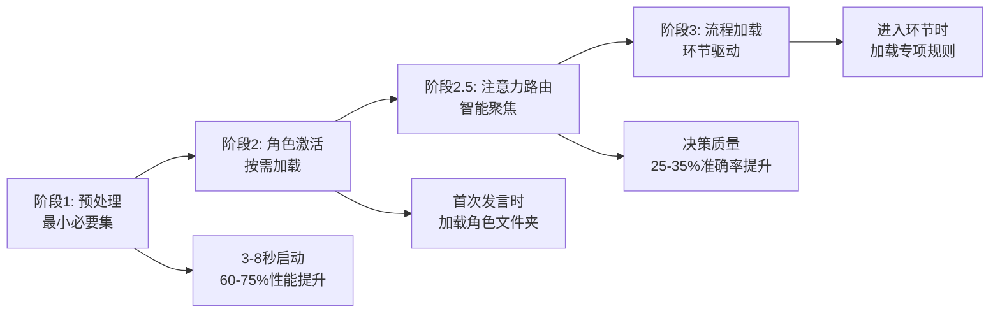

# 模拟法庭系统

## 系统架构

本系统采用**渐进式加载四引擎三层架构**设计：

1. **系统骨架层**：负责核心流程控制、渐进式加载调度和智能注意力分配
2. **智能协议层**：按案件类型提供专业化规则和流程
3. **认知组件层**：提供可重用的智能分析功能

### 🚀 渐进式加载优化

系统采用四阶段渐进式加载策略，大幅提升性能和用户体验：



## 使用方法

### 启动系统

```
输入命令：开始审理：[案件名称]
```

系统将自动：

1. 检测案件类型（民事/刑事/行政）
2. 加载对应专业协议
3. 初始化法官角色
4. 开始庭审流程

### 系统组件映射

#### 1. 系统骨架

| 组件名称                                          | 功能说明                     | 性能提升            |
| ------------------------------------------------- | ---------------------------- | ------------------- |
| [渐进式加载集成](core/系统骨架/渐进式加载集成.md) | 四引擎协同，总体架构设计     | 🎯 总体 60-75%提升  |
| [预处理引擎](core/系统骨架/预处理引擎.md)         | 最小必要集加载，快速启动     | 🚀 启动速度 60-75%  |
| [角色激活引擎](core/系统骨架/角色激活引擎.md)     | 按需激活角色，加载文件夹内容 | ⚡ 切换效率 3-5 倍  |
| [流程加载引擎](core/系统骨架/流程加载引擎.md)     | 环节驱动加载，精准控制       | 🧠 内存节省 50-60%  |
| [注意力路由引擎](core/系统骨架/注意力路由引擎.md) | 智能注意力分配，认知聚焦     | 🎯 决策质量 +25-35% |
| [庭审引擎](core/系统骨架/庭审引擎.md)             | 控制庭审节奏，路由至专业协议 | 智能协调四大引擎    |
| [权威裁判](core/系统骨架/权威裁判.md)             | 法官角色规范与穿透审判能力   | 预处理阶段快速激活  |
| [庭审执行](core/系统骨架/庭审执行.md)             | 执行庭审流程，管理角色切换   | 渐进式流程管理      |

#### 2. 智能协议

| 案件类型 | 协议文件                                   | 证据规则                                       |
| -------- | ------------------------------------------ | ---------------------------------------------- |
| 民事案件 | [民事主协议](core/智能协议/民事/主协议.md) | [民事证据规则](core/智能协议/民事/证据规则.md) |
| 刑事案件 | [刑事主协议](core/智能协议/刑事/主协议.md) | [刑事证据规则](core/智能协议/刑事/证据规则.md) |
| 行政案件 | [行政主协议](core/智能协议/行政/主协议.md) | [行政证据规则](core/智能协议/行政/证据规则.md) |

#### 3. 认知组件

| 组件名称                              | 功能说明                 |
| ------------------------------------- | ------------------------ |
| [争议聚焦](core/认知组件/争议聚焦.md) | 识别和定义案件核心争议点 |
| [证据引擎](core/认知组件/证据引擎.md) | 处理和分析证据的通用组件 |

#### 4. 判决后协议

| 组件名称                                | 功能说明               |
| --------------------------------------- | ---------------------- |
| [判决生成](core/判决后协议/判决生成.md) | 生成专业、规范的判决书 |

## 优化后的系统工作流程

### 🎯 阶段 1: 智能预处理 (3-8 秒)


**加载内容**：

- 庭审引擎.md + 庭审执行.md
- 法官行为原则.md + 律师行为原则.md
- 案件类型识别机制

### ⚡ 阶段 2: 无面代入角色激活

```mermaid
graph TD
    A[法官指定发言] --> B[激活无面者]
    B --> C[学习目标角色]
    C --> D[角色代入完成]
    D --> E[配置专属注意力]
    E --> F[设置委托人身份]
    F --> G[执行角色宣誓]
    G --> H[角色就绪发言]
    
    B --> B1[promptx_action("noface")]
    C --> C1[learn @file://角色路径]
```

**触发时机**：律师首次被指定发言时
**关键创新**：通过无面学习机制代入角色，解决PromptX升级后的角色引用问题
**角色路径**：
- 律师: `/Users/huangyanxiang/Desktop/文件汇总/代码/.promptx/resource/role/lawyer`
- 法官: `/Users/huangyanxiang/Desktop/文件汇总/代码/.promptx/resource/role/judge`

### 🔄 阶段 3: 流程智能加载


**环节映射**：

- 质证环节 → 证据规则.md + 证据引擎.md
- 争议焦点 → 争议聚焦.md
- 法庭辩论 → 辩论规则.md
- 判决阶段 → 判决生成.md

## 案件类型处理能力

系统目前支持的案件类型：

### 民事案件

- 合同纠纷
- 侵权纠纷
- 物权纠纷
- 婚姻家庭纠纷
- 继承纠纷
- 等其他民事纠纷

### 刑事案件

- 危害公共安全罪
- 破坏社会主义市场经济秩序罪
- 侵犯公民人身权利、民主权利罪
- 侵犯财产罪
- 妨害社会管理秩序罪
- 等其他刑事案件

### 行政案件

- 行政处罚案件
- 行政许可案件
- 政府信息公开案件
- 行政强制案件
- 等其他行政案件

## 角色权限

系统角色权限严格限制：

1. **法官角色**：

   - 禁止读取任何方的《诉讼目的》文件
   - 禁止查看【】包裹的文件夹
   - 仅基于公开证据和庭审陈述作出判断

2. **律师角色**：
   - 只能读取本方文件夹内容
   - 禁止读取其他方的任何材料
   - 绝对禁止自认不利事实
   - 严格禁止越界辩论

## 开始使用

输入以下命令开始模拟审理：

```
开始审理：案件名称
```

系统会自动启动庭审引擎，识别案件类型并路由至相应专业协议。
